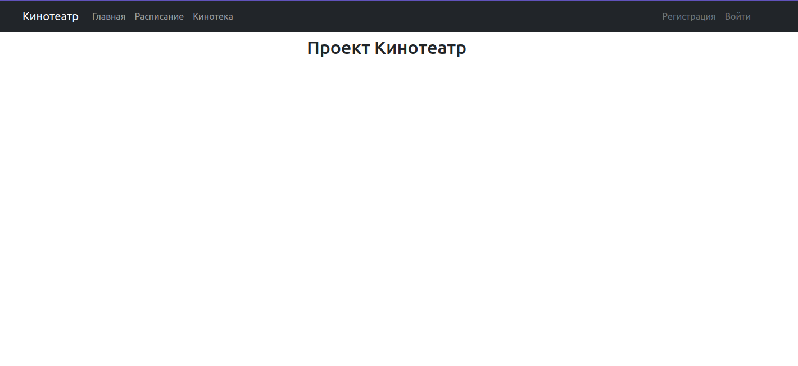
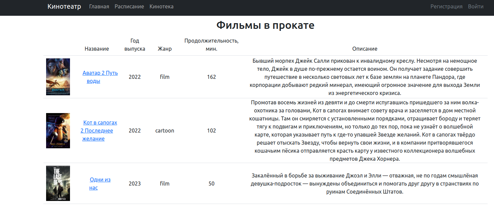
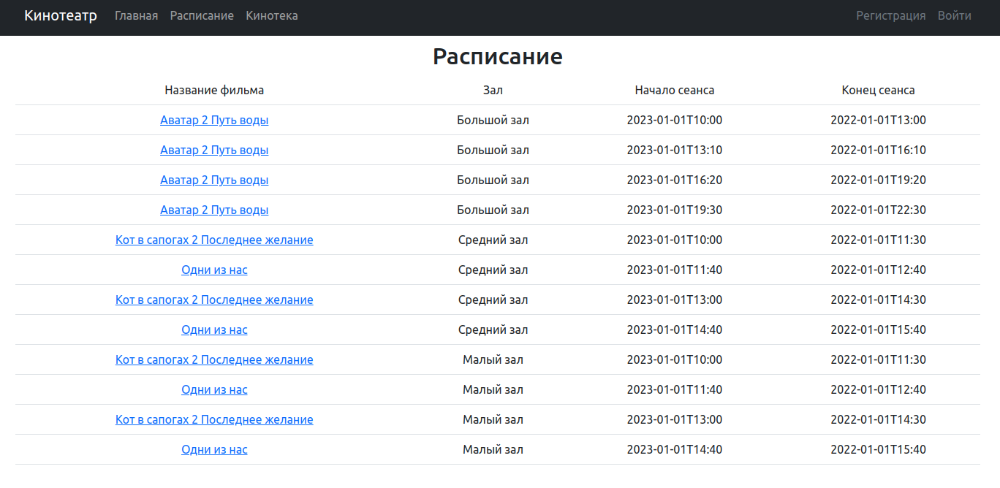
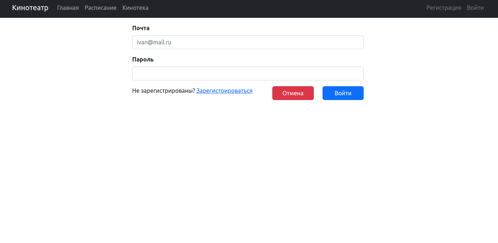
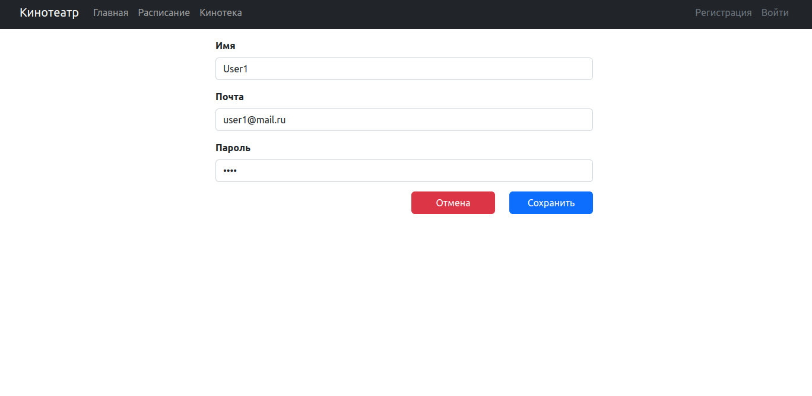
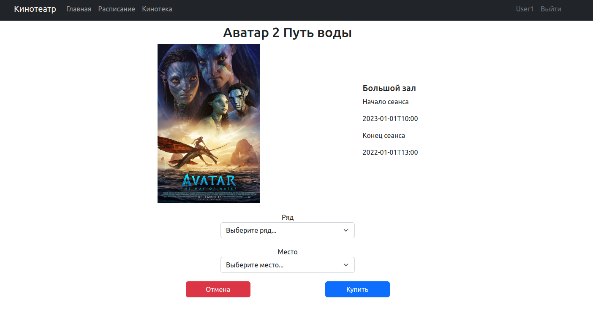
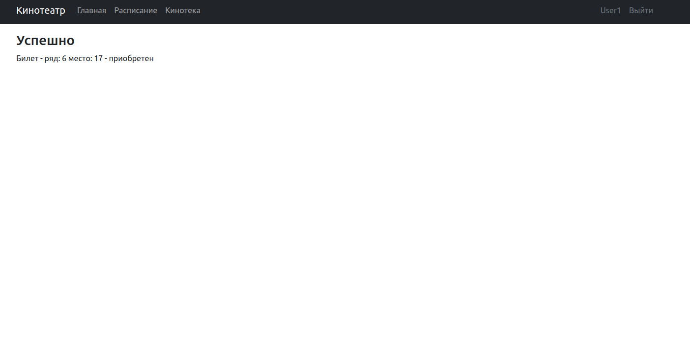
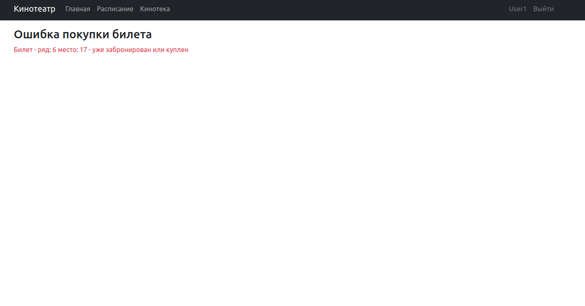

# Проект - Сервис кинотеатр
Проект представляет собой сервис по покупке билетов.
Неавторизованный пользователь может просматривать сеансы и описание фильмов, 
после авторизации появляется возможность покупки билетов.

## Использованные технологии
* PostgreSQL 42.5.1
* SQL2O 1.6.0
* Spring Boot 2.7.6
* H2 Database 2.1.214
* Thymeleaf
* HTML, CSS
* Bootstrap 5.2.3
* Junit 5.8.2
* Mockito 4.5.1

## Требования к окружению
* Maven 3.6.3
* JDK 17
* PostgreSQL 15

## Запуск проекта
1. Установить JDK 
2. Установить Maven
3. Установить PostgreSQL
4. Установить сервер БД PostgreSQL с именем cinema. При установке задать:
   Имя пользователя - postgres
   Пароль - postgres
   Порт - 5432
5. Скачать проект с GitHub и перейти в корень проекта
6. Выполните команду:
```shell
mvn spring-boot:run
```
## Взаимодействие с проектом
1. Перейдя по URL http://localhost:8080/ произойдет переход на главный экран:

2. Перейдя в кинотеку будет открыт список фильмов кинотеатра:

3. Перейдя во вкладку расписание будет открыт список всех сеансов:

4. Перейдя на любой из сеансов система потребует авторизации:

5. Страница регистрации:

6. После авторизации будут доступны для просмотра сеансы:

7. Выбрав нужный билет можно будет произвести покупку:


8. В случае попытки покупки уже купленного билета система выдаст ошибку:


## Контакты
vithag97@mail.ru